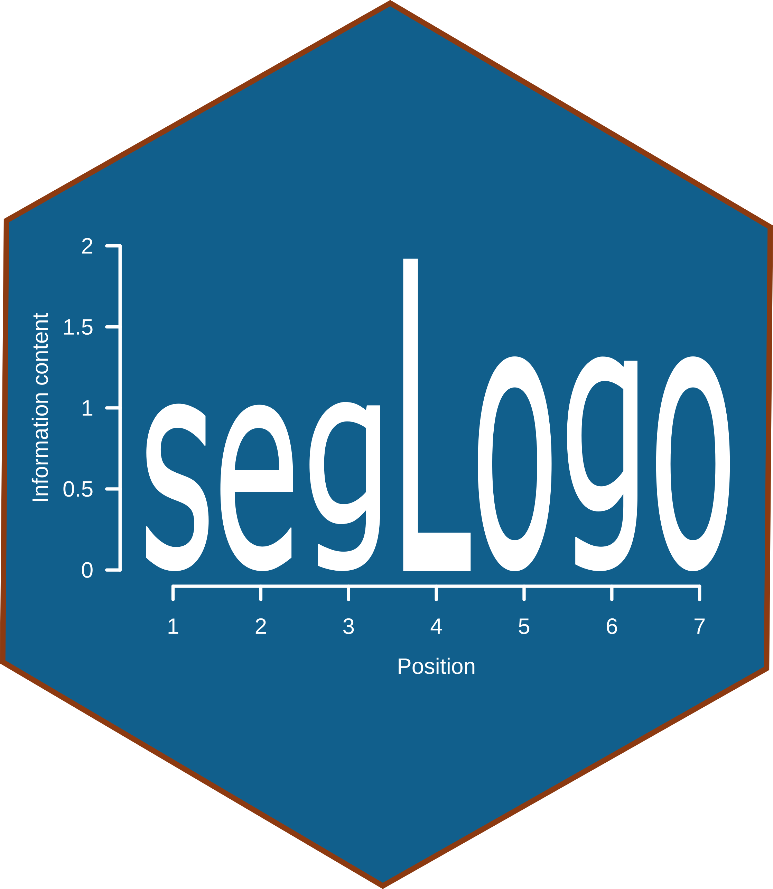

# _seqLogo_ - Plotting the position weight matrix of a DNA/RNA sequence motif as a sequence logo

## Software status

<!-- badges: start -->
[](http://www.repostatus.org/#active)
[](https://bioconductor.org/packages/seqLogo) 
[](https://bioconductor.org/packages/stats/bioc/seqLogo/)
[](https://support.bioconductor.org/t/seqLogo/)
[](https://github.com/ivanek/seqLogo/issues)
<!-- badges: end -->

&nbsp;

|                     | Bioc ([release](https://bioconductor.org/packages/release/bioc/html/seqLogo.html)) | Bioc ([devel](https://bioconductor.org/packages/devel/bioc/html/seqLogo.html)) |
|:--------------------|----------------------------------------------------------------------------:|--------------------------------------------------------------------------------:|
| OS                  | [](https://bioconductor.org/checkResults/release/bioc-LATEST/seqLogo/) | [](https://bioconductor.org/checkResults/devel/bioc-LATEST/seqLogo/) |
| Bioc Last Update    | [](https://bioconductor.org/checkResults/release/bioc-LATEST/seqLogo/) | [](https://bioconductor.org/checkResults/devel/bioc-LATEST/seqLogo/) |
| Bioc Status         | [](https://bioconductor.org/checkResults/release/bioc-LATEST/seqLogo) | [](https://bioconductor.org/checkResults/devel/bioc-LATEST/seqLogo) |
| GitHub Last Commit  | [](https://github.com/ivanek/seqLogo/tree/RELEASE_3_17) | [](https://github.com/ivanek/seqLogo/tree/devel/) |
| GitHub Actions      | [](https://github.com/ivanek/seqLogo/actions) | [](https://github.com/ivanek/seqLogo/actions) |
| Coverage            | [](https://codecov.io/gh/ivanek/seqLogo/branch/RELEASE_3_17) | [](https://codecov.io/github/ivanek/seqLogo) |

## Authors

- Oliver Bembom
- Robert Ivanek

## Overview

seqLogo takes the position weight matrix of a DNA sequence motif and plots 
the corresponding sequence logo as introduced by Schneider and Stephens (1990).

## Installation

#### Release version

```
if (!requireNamespace("BiocManager", quietly = TRUE))
    install.packages("BiocManager")
BiocManager::install("seqLogo", version = "release")
```

#### Developmental version

```
if (!requireNamespace("BiocManager", quietly = TRUE))
    install.packages("BiocManager")
BiocManager::install("seqLogo", version = "devel")
```

#### Github

```
if (!requireNamespace("remotes", quietly = TRUE))
    install.packages("remotes")
remotes::install_github("ivanek/seqLogo")
```

## Usage

For detailed instructions check the package vignette 
([release](https://bioconductor.org/packages/release/bioc/vignettes/seqLogo/inst/doc/seqLogo.pdf) 
or 
[developmental](https://bioconductor.org/packages/devel/bioc/vignettes/seqLogo/inst/doc/seqLogo.html) 
version). Or the GitHub.io [page](https://ivanek.github.io/seqLogo/).

## Citation 

```
citation("seqLogo")
```

- Oliver Bembom and Robert Ivanek (2020). seqLogo: Sequence logos for DNA sequence alignments.
